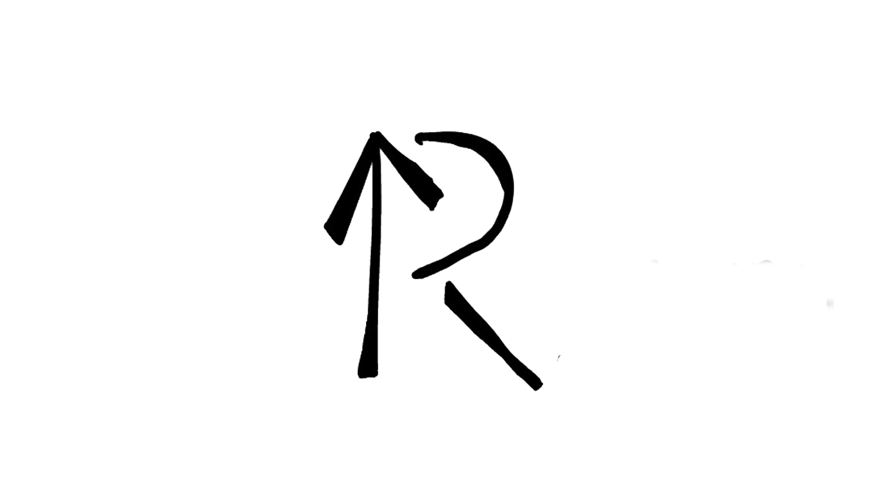

# RemUp

<!-- 语言切换器 -->
<div align="right">
  <small>
    🌐 <strong>语言:</strong> 
    <a href="README.md">中文</a> • 
    <a href="README_eng.md">English</a>
  </small>
</div>

**RemUp** 是一个创新的轻量级标记语言，专为构建"学习-理解-再学习"的记忆闭环而设计。

## 核心概念

### 🎴 记忆单元系统
RemUp 以卡片为"记忆单元"组织知识，RemUp的核心概念如下：
- **主卡**：结构化知识承载，使用 `<+主题` 和 `/+>` 定义
- **注卡**：理解深化工具，使用 `` `内容`[批注] `` 创建交互式批注
- **归档**：系统性复习支持，使用 `--<主题>--` 分组管理

### 🔄 学习闭环流程
1. **学习**：创建主卡记录核心知识点
2. **理解**：通过注卡添加个人理解和关联
3. **再学习**：利用链接标签和归档系统进行系统性复习

## 语法速查表

| 语法元素 | 格式 | 功能 | 示例 |
|---------|------|------|------|
| **主卡开始** | `<+主题` | 定义记忆单元 | `<+vigilant` |
| **主卡结束** | `/+>` | 结束当前卡片 | `/+>` |
| **标签** | `(符号: 内容)` | 右上角标签 | `(!: 重要)` |
| **链接标签** | `(符号: #目标, 内容)` | 可跳转标签 | `(>: #careful, 近义词)` |
| **区域划分** | `---区域名` | 内容分区 | `---例句` |
| **行内解释** | `>>解释` | 灰色解释文字 | `保持警惕>>stay alert` |
| **注卡批注** | `` `内容`[批注] `` | 交互式批注 | `` `网络`[internet] `` |
| **归档标记** | `--<主题>--` | 卡片分组 | `--<重点词汇>--` |

## 完整示例

```remup
--<英语学习>--
<+vigilant
(>: #careful, #watchful, 近义词)
(!: 重点词汇)

---解释
adj. 警惕的；警觉的；戒备的
`vigilant`[来自拉丁语vigilare，意为"保持清醒"] >>形容词

---词组
- be vigilant about/against/over >>对…保持警惕
- remain/stay vigilant >>保持警惕
- require vigilance >>需要警惕性

---例句
- Citizens are urged to remain vigilant against `网络诈骗`[指通过互联网进行的欺诈行为]。 >>敦促公民对网络诈骗保持警惕
- The security guard must be vigilant at all times. >>保安必须时刻保持警觉。
/+
```

## 快速开始

### 1. 创建第一个主卡

创建一个 `.ru` 文件（RemUp文件）：

```remup
<+python_function
(!: 编程概念)

---定义
`函数`[完成特定功能的代码块] >>function
是组织代码的基本单元。

---语法
    ```python
    def greet(name):
        return f"Hello, {name}!"
    ```

---说明
- 使用 `def` 关键字定义函数
- 函数名后跟括号和参数
- 函数体缩进，使用 `return` 返回值
/+
```

### 2. 添加交互式注卡

在需要解释的内容上添加注卡：

```remup
在Python中，`变量`[存储数据的容器]用于保存数据。
`列表`[有序的元素集合]是一种常用的数据结构。
```

### 3. 使用归档组织内容

```remup
--<Python基础>--
<+variable.../+>
<+function.../+>
<+list.../+>

--<Python进阶>--
<+class.../+>
<+decorator.../+>
```

## 安装与使用

### 系统要求
- Python 3.8 或更高版本

### 安装步骤

1. **克隆仓库**
   ```bash
   git clone https://github.com/MingShuo-S/PPL_Project-RemUp.git
   cd PPL_Project-RemUp
   ```

2. **创建虚拟环境**
   ```bash
   python -m venv venv
   source venv/bin/activate  # Linux/macOS
   # 或者
   venv\Scripts\activate  # Windows
   ```

3. **安装依赖**
   ```bash
   pip install -r requirements.txt
   ```

4. **编译RemUp文件**
   ```bash
   python remup_compiler.py example.ru
   ```

## 项目结构

```
PPL_Project-RemUp/
├── src/                    # 源代码目录
│   ├── compiler/          # RemUp编译器核心
│   │   ├── parser.py      # 语法解析器
│   │   ├── transformer.py # AST转换器
│   │   └── generator.py   # HTML生成器
│   ├── core/              # 核心数据类型
│   │   ├── cards.py       # 卡片模型定义
│   │   └── annotations.py # 注卡系统
│   └── utils/             # 工具函数
├── examples/              # 示例文件
│   ├── vocabulary.ru      # 词汇学习示例
│   ├── programming.ru     # 编程概念示例
│   └── concepts.ru         # 概念学习示例
├── templates/              # 输出模板
├── docs/                  # 文档
├── requirements.txt       # Python依赖
└── README.md             # 本项目说明
```

## 核心特性详解

### 🎯 主卡系统
主卡是知识的核心载体，支持：
- **结构化内容**：通过区域划分组织不同部分
- **智能标签**：分类、重要度、关联关系标记
- **多媒体支持**：代码块、图片、表格等丰富内容

### 💡 注卡系统
注卡实现深度理解：
- **交互式显示**：悬停查看、点击固定
- **自动归档**：每个注卡生成独立主卡，构建知识网络
- **双向链接**：注卡与主卡相互引用，形成知识图谱

### 📚 归档系统
归档支持系统性学习：
- **主题分类**：按领域、难度、类型分组
- **智能导航**：自动生成目录和导航链接
- **复习计划**：基于归档的间隔重复复习

## 贡献指南

我们欢迎任何形式的贡献！请参阅以下指南：

### 贡献方式
1. Fork 本仓库
2. 创建特性分支 (`git checkout -b feature/AmazingFeature`)
3. 提交更改 (`git commit -m 'Add some AmazingFeature'`)
4. 推送到分支 (`git push origin feature/AmazingFeature`)
5. 开启 Pull Request

### 开发重点
- 语法解析器的完善和优化
- 注卡交互功能的增强
- 模板系统的设计与实现
- 导出格式的扩展（PDF、Anki等）

## 许可证

本项目基于 MIT 许可证 - 查看 LICENSE 文件了解详情。

## 联系方式

- **作者**: MingShuo-S
- **邮箱**: 2954809209@qq.com
- **项目链接**: https://github.com/MingShuo-S/PPL_Project-RemUp

---

如果这个项目对你有帮助，请考虑给它一个 ⭐️ ！

**开始你的记忆升级之旅吧！** 🚀